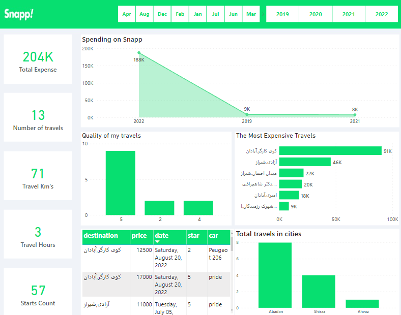

#  Snapp Travels Dashboard Project : 

Snapp! is an Iranian service provider, allowing users to book a car and driver to transport them in a way similar to a taxi. Snapp is currently the most popular online taxi rental service in Iran, so I decided to analyze my use of this popular service.

# Project Overview : 

## 1 - Collecting Data : 

Since Snapp did not have an api or source to receive data related to my travel history. I used a bot to collect my data from the snapp web app

#### What data did I collect ?

 - Number of travels
 - Total Hours of travels
 - Total kilometers traveled 
 - Travel day title
 - Car that i traveld with 
 - Travel cost
 - Travel date 
 - trave time (hour)
 - Initial point of travel
 - Travel destination
 - How many star were my travel

## 2 - Preprocess and Feature engineering collected data : 

 - Drop canceld travels 
 - Extract destination location from data  
 - Extract origin city (translated in english)
 - Extract date and convert it form jalali (persain date unit into gregorian) 
 - Translate car model in English
 - Convert travel cost from rial to toman and translate it (English)
 - Split Curreny from price 
 - Drop uneeded columns  
 - Save data into csv file 

## 3 - Creating the dashboard using Power BI

For creating dashboard i used Power BI an powerful tool and interactive data visualization software product developed by Microsoft 

#### What i persented in my dashboard :

- Total Expense of travels 
- Total Hours of travels
- Total kilometers traveled 
- Total stars givin 
- Total cost of travels (dynamic in year and month)
- Quality of my travels (How many stars were my tavels mostly ?)
- Where was the most expensive travels for me ?
- In which cities did I use snapp the most ?
- My travels table (all of my travels (dynamic by sorting) )

## Libraries and software used : 
 
 - [Power BI](https://powerbi.microsoft.com/en/)
 - [selenium](https://www.selenium.dev/)
 - [pandas](https://pandas.pydata.org/)
 - [persiantools](https://pypi.org/project/persiantools/)
 - [deep-translator](https://pypi.org/project/deep-translator/)  
